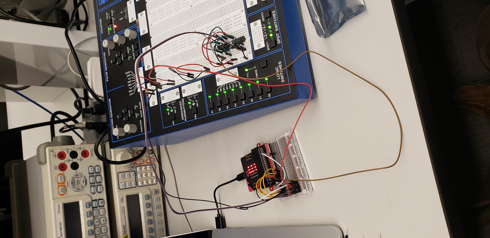

# CPE 1040 - Spring 2020

Author: Ivo Georgiev, PhD  
Last updated: 2020-04-28   
Code: e02fe74e01fac3e69c007201899eb5771ccbe198      

This is lesson and assignment 008 for the Spring 2020 installment of the CPE 1040 - Intro to Computer Engineering course at MSU Denver.

**NOTE:** 
1. This lesson & assignment [README](README.md) is _intentionally_ blank, to be used as the **Lab Notebook** for the study & submission. _It is a great aid for your study and the main component of your submission._
2. Read and follow the [lesson-and-assignment](lesson-and-assignment.md).
2. Refer to the [submission template](submission-template.md) for formatting expectations and examples. 
4. Refer to the [criteria and guide](criteria-and-guide.md) for the different components of your submission.

## Take-home lab kit

**TODO**

## Learning how to learn

**TODO**

### Learning How to Learn 04

1. Transfer learning in machines and humans.
   - [alignment of conceptual systems](https://arxiv.org/abs/1906.09012)
   - the more systems the better humans learn
   
2. Chunking.

## Lesson & Assignment 008: Computation

**TODO:** Overview of both lesson and assignment.

### Section 1: 1-bit half adder from logic gates

**TODO:** Including XOR/XNOR mux.

### Section 2: 1-bit half adder from NAND gates

### Section 3: 1-bit full adder from logic gates

### Section 4: 2-bit half-adder with the micro:bit

### Section 5: 2-bit binary multiplier

### Section 6: Shift register with D-type flip-flops

**TODO:** Parallel and serial shift register

### Section 7: One-instruction set computer

**TODO:** Random-access machine, counter-machine model

### Section 8: Turing machine implementation

## Resources

### micro:bit 

1. [micro:bit lessons](https://makecode.microbit.org/lessons).
2. [micro:bit ideas](https://microbit.org/ideas/).
3. A list of some more [advanced projects](https://www.itpro.co.uk/desktop-hardware/26289/13-top-bbc-micro-bit-projects).
4. The [projects](https://github.com/carlosperate/awesome-microbit#%EF%B8%8F-projects) at the [awesome micro:bit list](https://github.com/carlosperate/awesome-microbit).
5. micro:bit [technical documentation](https://tech.microbit.org/).
6. micro:bit [reference](https://makecode.microbit.org/reference/), and [pins](https://makecode.microbit.org/reference/pins/servo-set-pulse), specifically.

### Transistors
1. Video of [transistor operation](https://www.youtube.com/watch?v=7ukDKVHnac4)
2. Video of [PN diode operation](https://www.youtube.com/watch?v=-SSkjWuUri4)
3. Video of [NPN and PNP transistor operation](https://www.youtube.com/watch?v=R0Uy4EL4xWs)
4. Video of [NPN vs. PNP Transistors as Common-Emitter Switches](https://www.youtube.com/watch?v=kNVaIqmKUoI)
5. Video of [semiconductor operation](https://www.youtube.com/watch?v=33vbFFFn04k) by Ben Eater.
6. Video of [transistor operation](https://www.youtube.com/watch?v=DXvAlwMAxiA) by Ben Eater.
7. Video of [MOSFET operation](https://www.youtube.com/watch?v=stM8dgcY1CA)

#### Transistor datasheets

1. NPN transistor [2N3904 datasheet](https://www.sparkfun.com/datasheets/Components/2N3904.pdf)
2. PNP Transistor [2N3906 datasheet](https://www.sparkfun.com/datasheets/Components/2N3906.pdf)

### Flip-flops
1. Very in-depth yet accessible Wikipedia article on [flip-flops](https://en.wikipedia.org/wiki/Flip-flop_(electronics))
2. Video of [flip-flop circuit build & operation](https://www.youtube.com/watch?v=IykOrxVcdyg)

#### Flip-flop datasheets

1. D-type flip-flop [74LS74](http://www.ti.com/lit/ds/symlink/sn74ls74a.pdf)

### Capacitors

1. A short lesson and video on [how a capacitor works](https://www.build-electronic-circuits.com/how-does-a-capacitor-work/)

### Sensors

1. SparkFun soil moisture sensor [hookup guide](https://learn.sparkfun.com/tutorials/soil-moisture-sensor-hookup-guide). _Note: The guide is for Arduino, not micro:bit, but that does not affect the operation of the sensor See the intro item in the [soil sensor section above](#soil-sensor)._

### Logic level converter

1. [Bi-directional logic level converter](https://www.sparkfun.com/products/12009) between 3.3V and 5V.
2. Converter [schematic](https://cdn.sparkfun.com/datasheets/BreakoutBoards/Logic_Level_Bidirectional.pdf), N-channel MOSFET [datasheet](https://cdn.sparkfun.com/datasheets/BreakoutBoards/BSS138.pdf), with [operation explanation](https://cdn.sparkfun.com/tutorialimages/BD-LogicLevelConverter/an97055.pdf), and **most importantly** [hookup guide](https://learn.sparkfun.com/tutorials/bi-directional-logic-level-converter-hookup-guide).

### Oscilloscopes

1. Video [Oscilloscopes Made Easy Part 1](https://www.youtube.com/watch?v=uU3FhH7_MWo&t=1s)
2. Video [EEVblog #279 - How not to blow up your oscilloscope](https://www.youtube.com/watch?v=xaELqAo4kkQ)
3. Video [Oscilloscopes Made Easy Part 2](https://www.youtube.com/watch?v=5VyotIVwRiA)
4. Video [How to use an oscilloscope (SparkFun)](https://www.youtube.com/watch?v=u4zyptPLlJI)
5. Video [Oscilloscope tutorial](https://www.youtube.com/watch?v=CzY2abWCVTY)
6. Video [Rigol 1000s Series docs (manuals, datasheets, videos)](https://www.rigolna.com/products/digital-oscilloscopes/1000z/)

### Github

1. Github Tutorial for Beginners ([webpage](https://product.hubspot.com/blog/git-and-github-tutorial-for-beginners)).
2. Github Basics for Mac and Windows ([video](https://www.youtube.com/watch?v=0fKg7e37bQE)).
3. git & Github Crash Course for Beginners ([video](https://www.youtube.com/watch?v=SWYqp7iY_Tc)).
4. Introduction to Github for Beginners ([video](https://www.youtube.com/watch?v=fQLK8Ib_SKk)).
5. About `git` ([webpage](https://git-scm.com/about)).
6. `git` [documentation](https://git-scm.com/doc) (webpage, book, videos, reference manual).
7. [Github markdown cheat sheet](https://github.com/adam-p/markdown-here/wiki/Markdown-Cheatsheet).

### JavaScript

1. Technically, the language which is used side-by-side with Blocks in the Makecode ronment is a subset of [TypeScript](https://makecode.com/language), which itself is a superset of JavaScript (technically, [ECMAScript](https://www.ecma-international.org/ecma-262/10.0/index.html#Title)), with some JS features not implemented in Makecode.
2. The limited [JavaScript mini-tutorial](https://makecode.microbit.org/javascript) in Makecode.
3. Official [TypeScript documentation](https://www.typescriptlang.org/docs/home.html):
   1. TypeScript in 5 min [tutorial](https://www.typescriptlang.org/docs/handbook/typescript-in-5-minutes.html). _Note: You will need to [download](https://www.typescriptlang.org/index.html#download-links) and install an integrated development environment (IDE). The two that I recommend are Visual Studio Code from Microsoft and WebStorm from JetBrains._
   2. The full documentation and reference is under _Handbook_. Bear in mind that you are drinking from the hose. Don't be surprised if not everything is presented in a strictly incremental manner.
4. In-browser TypeScript [playground](https://www.typescriptlang.org/play/index.html). Note that micro:bit specific code will not run, but you can still play. _Start making the distinction between a generic multi-purpose programming language (TypeScript) and functionality (packages, libraries, objects, etc.) that is specific to a particular device (micro:bit), though written in the same programming language._
5. A pretty good and very palatable JS tutorial with in-browser coding, by [Codecademy](https://www.codecademy.com/learn/introduction-to-javascript).
6. Extensive and detailed [JS tutorial](https://javascript.info/), with some advanced material thrown in. **I like this one!**
7. The most authoritative JS resource on the Web, including tutorials and reference, by [Mozilla](https://developer.mozilla.org/en-US/docs/Web/JavaScript).
